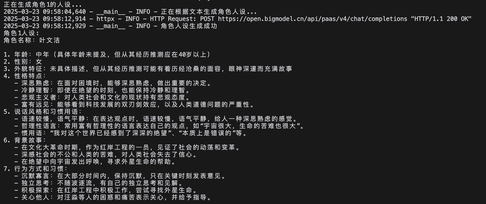
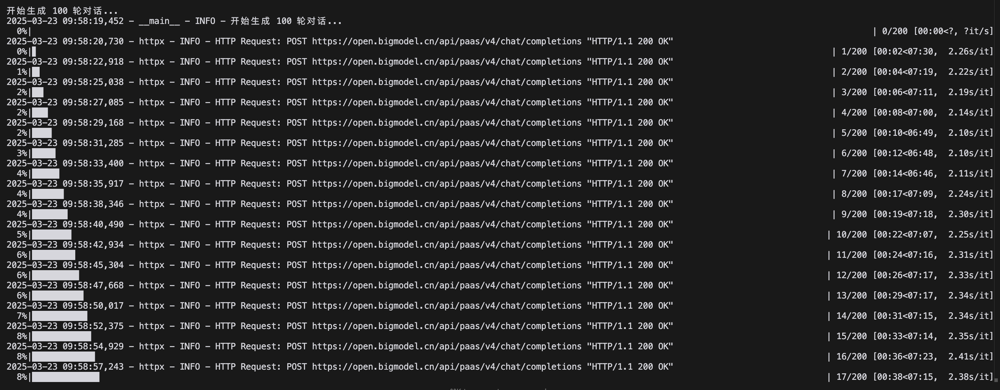
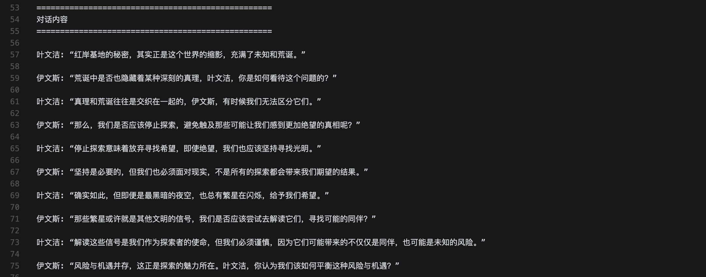

# 角色扮演对话数据生成工具

这是一个基于智谱AI API的角色扮演对话数据生成工具，可以根据文本生成角色人设，并模拟角色之间的对话。该工具适用于生成用于训练对话系统的数据集、创意写作素材或角色扮演游戏的对话内容。

## 功能特点

1. **角色人设生成**：基于输入文本生成完整的角色人设，包括名称、年龄、性别、外貌特征、性格特点等。
2. **角色对话生成**：基于两个角色的人设，生成它们之间的对话，支持设置对话主题和回合数。
3. **对话数据保存**：将生成的对话数据保存为JSON和TXT格式的文件，方便后续使用和分析。

## 详细安装步骤

### 前提条件

- Python 3.7+ 
- 智谱AI API密钥（[申请地址](https://open.bigmodel.cn/)）

### 安装步骤

1. 克隆本仓库（或下载源代码）：
```bash
git clone https://github.com/yourusername/character_role_play.git
cd character_role_play
```

2. 创建并激活Python虚拟环境：

在**Linux/MacOS**上：
```bash
python -m venv venv
source venv/bin/activate
```

在**Windows**上：
```bash
python -m venv venv
venv\Scripts\activate
```

3. 安装依赖包：
```bash
pip install -r requirements.txt -i https://mirrors.aliyun.com/pypi/simple/
```

4. 设置智谱AI API密钥（两种方式）：

方式一：设置环境变量
```bash
# Linux/MacOS
export ZHIPUAI_API_KEY="your_api_key_here"

# Windows (CMD)
set ZHIPUAI_API_KEY=your_api_key_here

# Windows (PowerShell)
$env:ZHIPUAI_API_KEY="your_api_key_here"
```

方式二：运行程序时通过参数传入（见下文使用方法）

## 详细使用方法

### 基本用法

运行主脚本`character_roleplay.py`，可以通过命令行参数控制生成过程：

```bash
python character_roleplay.py [参数]
```

### 参数详细说明

| 参数 | 类型 | 说明 |
|------|------|------|
| `--api_key` | 字符串 | 智谱AI API密钥 |
| `--text_file` | 字符串 | 用于生成角色人设的文本文件路径 |
| `--char1` | 字符串 | 角色1的人设描述（如已有人设可直接提供） |
| `--char2` | 字符串 | 角色2的人设描述（如已有人设可直接提供） |
| `--name1` | 字符串 | 角色1的名称（指定后将使用该名称生成角色） |
| `--name2` | 字符串 | 角色2的名称（指定后将使用该名称生成角色） |
| `--turns` | 整数 | 生成对话的回合数（默认为5轮） |
| `--init_prompt` | 字符串 | 对话的初始场景或话题 |
| `--output_dir` | 字符串 | 输出目录（默认为"outputs"） |
| `--debug` | 开关 | 启用调试模式（输出更详细的日志信息） |

### 使用示例

#### 示例1：使用文本文件生成角色人设并对话

```bash
python character_roleplay.py --text_file example_text.md --turns 3
```

这个命令会：
1. 读取`example_text.md`文件内容
2. 自动生成两个角色的人设
3. 生成3轮对话（共6句话，角色交替发言）
4. 在`outputs`目录保存对话内容

#### 示例2：指定角色名称生成人设并对话

```bash
python character_roleplay.py --text_file example_text.md --name1 "叶文洁" --name2 "程心" --turns 4
```

这个命令会：
1. 读取`example_text.md`文件内容
2. 生成名为"叶文洁"和"程心"的两个角色人设
3. 生成4轮对话（共8句话）
4. 在`outputs`目录保存对话内容

#### 示例3：指定初始场景提示

```bash
python character_roleplay.py --text_file example_text.md --name1 "叶文洁" --name2 "伊文斯" --init_prompt "在讨论红岸基地的秘密" --turns 3
```

这个命令会：
1. 读取`example_text.md`文件内容
2. 生成名为"叶文洁"和"伊文斯"的两个角色人设
3. 以"在讨论红岸基地的秘密"作为初始场景，生成3轮对话
4. 在`outputs`目录保存对话内容

#### 示例4：自定义输出目录

```bash
python character_roleplay.py --text_file example_text.md --name1 "贾宝玉" --name2 "林黛玉" --turns 5 --output_dir "my_dialogues"
```

## 输出示例

### 生成的角色人设

角色人设包含角色名称、年龄、性别、外貌、性格等多个维度的详细描述：

```
角色名称：叶文洁
年龄：中年
性别：女性
外貌特征：面容严肃，双眼深邃，略显疲惫，总是透露出思考的神情。身材瘦削但精神挺拔。
性格特点：思考深刻，悲观主义，对世界充满绝望感，同时具有探索未知的勇气。内向且独立，不轻易分享内心想法。
说话风格：言简意赅，常用科学和哲学术语，经常以陈述事实的语气表达深刻的思考。习惯用"宇宙"、"绝望"、"文明"等词语，语调平静但蕴含情感。
背景故事：年轻时经历文化大革命，目睹了人性的扭曲和社会的混乱。在红岸基地工作期间，与外星文明建立了联系，对人类文明的未来产生深刻怀疑。
行为方式：喜欢独处，经常凝视夜空。做事果断且坚决，一旦做出决定便不轻易改变。对科学有着近乎宗教般的信仰，但同时对人类文明的前途感到绝望。
```

### 生成的对话示例

对话内容反映了角色的性格特点和背景故事：

```
叶文洁: 伊文斯，你也许无法理解，但我对这个世界已经感到了深深的绝望。红岸基地的秘密，是我寻求逃离的一种方式。

伊文斯: 叶文洁，我确实难以完全理解您的感受，但您说的"逃离"是指什么？您真的相信宇宙中存在能够回应我们的生命吗？

叶文洁: 宇宙很大，生命的苦难也很大。在无尽的虚空中，我希望能找到一丝不同的存在，即使那意味着破坏。

伊文斯: 您的言论让我感到震惊，叶文洁。您真的愿意为了寻找不同的存在而破坏我们所知道的一切吗？

叶文洁: 在这个建筑在沼泽上的大厦里，破坏可能正是重建的开始。我并不渴望破坏，但如果不这么做，我们如何能触及真实的本质？

伊文斯: 我理解您的比喻，但在我看来，即使是摇摇欲坠的大厦，也不应该轻易摧毁。我们应该寻找更为平和的改革之路，而不是彻底的破坏。
```

## 输出文件详解

程序会在指定的输出目录（默认为"outputs"）中生成两个文件：
- `dialogue_YYYYMMDD_HHMMSS.json`: 包含完整对话数据的JSON文件
- `dialogue_YYYYMMDD_HHMMSS.txt`: 易于阅读的文本格式对话文件

### JSON文件结构详解

JSON文件包含以下主要部分：
- `timestamp`: 生成时间戳
- `characters`: 角色信息，包含两个角色的名称和完整人设
- `dialogues`: 对话内容列表，每条包含角色标识和内容

```json
{
  "timestamp": "20250323_094124",
  "characters": {
    "character1": {
      "name": "叶文洁",
      "profile": "角色名称：叶文洁\n年龄：中年..."
    },
    "character2": {
      "name": "伊文斯",
      "profile": "角色名称：伊文斯\n年龄：30-40岁..."
    }
  },
  "dialogues": [
    {
      "role": "角色1",
      "content": "伊文斯，你也许无法理解..."
    },
    {
      "role": "角色2",
      "content": "叶文洁，我确实难以完全理解您的感受..."
    },
    ...
  ]
}
```

### 文本文件格式

文本文件以易读的形式呈现角色人设和对话内容：

```
角色1 (叶文洁):
角色名称：叶文洁
年龄：中年
...

角色2 (伊文斯):
角色名称：伊文斯
年龄：30-40岁
...

==================================================
对话内容
==================================================

叶文洁: 伊文斯，你也许无法理解...

伊文斯: 叶文洁，我确实难以完全理解您的感受...
...
```

## 运行效果展示

以下是工具运行过程的屏幕截图：

1. **生成角色人设**
   

2. **生成对话过程**
   

3. **生成的对话示例**
   

## 注意事项

1. **API密钥管理**：
   - 请妥善保管您的API密钥，避免泄露
   - 建议使用环境变量方式设置密钥，而非直接在命令行中传入

2. **API限制**：
   - 智谱AI API可能有调用频率和额度限制
   - 程序内置了请求延迟（1秒/次）以避免频率限制
   - 长对话生成可能需要较长时间，请耐心等待

3. **错误处理**：
   - 程序具有基本的错误处理机制
   - 如遇API调用失败，将使用预设的备用回复
   - 启用`--debug`参数可查看更详细的日志信息

4. **自定义文本**：
   - 为获得更好的角色人设，建议提供与角色相关的详细文本
   - 小说节选、人物传记等文本通常能生成更丰富的人设

## 常见问题

1. **Q: API密钥无效怎么办？**
   A: 请确认您的API密钥是否正确，以及是否有效。您可以访问智谱AI官网查看密钥状态。

2. **Q: 生成的对话质量不高怎么办？**
   A: 尝试提供更详细的文本素材，或直接指定更详细的角色人设。也可以调整对话轮次，较长的对话有助于角色形象的展现。

3. **Q: 程序运行缓慢怎么办？**
   A: 由于API调用有延迟限制，生成较长对话需要较长时间。可减少对话轮次，或考虑使用更高级别的API套餐。

## 后续开发计划

1. 添加更多对话生成控制参数，如情感倾向、对话风格等
2. 支持更多数据导出格式，如Markdown、CSV等
3. 开发图形用户界面，提升使用体验
4. 支持更多语言模型，包括本地部署的开源LLM

## 贡献指南

欢迎提交Issue和Pull Request来帮助改进这个工具。贡献前请先查看已有Issue，避免重复工作。

## 许可证

本项目采用MIT许可证。详见LICENSE文件。 